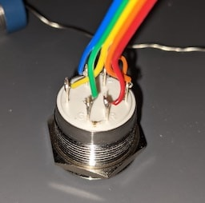
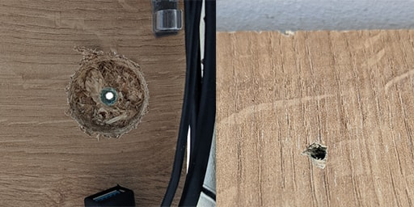

# Real Button


Software, firmware and a (cheap) hardware build for a real, physical button that can perform tasks on your computer.

I use this as a power button for my virtual machine on my [Unraid server](https://unraid.net/). New 'modules' will allow attached buttons to do new things, and display new state with its LEDs.

## Hardware build


### Build requirements

1. **An arduino**. I used an Arduino Nano from [AliExpress](https://www.aliexpress.com/item/4000579100527.html): £2
2. **One or more LED buttons**. I used a 22mm RGB 3V _common cathode_ button from [AliExpress](https://www.aliexpress.com/item/1005001868784089.html): £2
3. **Wiring**. These 5pin connector cables are perfect, from [AliExpress](https://www.aliexpress.com/item/1005002134761830.html): £1
4. **A soldering iron**

### Electrical build 

A really simple build, suitable for a first electronics project!

<a href="./docs/hardware/arduino-nano.fzz"></a>

1. Pick 4 arduino pins for each button (one for the button, and three for the LEDs). See the [Arduino Nano pinout diagram](https://content.arduino.cc/assets/Pinout-NANO_latest.pdf).

    I selected "PWM pins" for my LEDs (the ones labeled with a `~`) as these would allow fading in and out of the LEDs with firmware improvements.

    You can use any other `D…` pin that isn't labeled `RX` or `TX` for the button (those two serial port pins might interfere with the communication with your server, depending on your model of Arduino).
    
    I chose `D12` for my button, `~D11` for the red LED, `~D10` for the green LED, and `~D9` for the blue LED.
    
    This project's software can support up to 32 buttons, but the current draw for that many LEDs, and the number of pins available, will likely limit you to two or three buttons. Let me know if you get more working!


2. Solder the wires to your button and arduino.
   
    
    
   
    I started by joining the LED `-` pin to one of the button pins (doesn't matter which), then working round the other pins.
    
    I used red for red LED, green for green LED, blue for blue LED, orange for LED cathode (also connected to one of the button pins) and yellow for the other button pin. I used these colours so it'd be easy for me to know which wires go where on the arduino, a little extra challenging given they're disconnected.
    
    Normally you'd wire resistors in series with LEDs to provide them with the appropriate voltage, but for the LEDs on my buttons the arduino's internal resistors seem to do a decent job, and no resistors makes the build simpler!


### Install requirements


1. **Spade bits**. For my 22mm button I needed both 20mm bit and 32mm spade bits. [AliExpress](https://www.aliexpress.com/item/32858936654.html): £12
2. **A hand drill**.
3. A pair of pliars for tightening the button nut and (optional) a round file for minor adjustments to hole width.

### Installation

My buttons weren't tall enough to reach the depth of my desk, so I drilled two seperate concentric holes.



I measured the maximum width of the hexagonal nut around the button at ~30mm, so chose a 32mm spade bit for the first step.

I drilled up through my desk from underneath, ensuring the small pilot hole point made it through to the other side, but the large flat part of the bit stopped early, leaving a good half centimetre of desk for the next step.


I measured the threaded part of the button at 20mm, so drilled with a 20mm spade bit from the top down (using the existing hole to ensure they were aligned), and used a file to widen it just a little, as it was very tight!

This meant there was enough of a lip for the button to rest on, but space to tighten the hex nut on the button, using a pair of pliars.

## Firmware install

1. Open [`real-button.ino`](./real-button.ino) in the [Arduino IDE](https://www.arduino.cc/en/main/OldSoftwareReleases).
2. Edit line 10 to reference the pins for your button and red, green and blue button LEDs respectively

    ```c++
    const RGBButton button_pins[] = {
      {12,11,10,9}
    };
    ```
    
   (You can add more lines, if you have more buttons!)
3. Flash your arduino! 

## Software install

Create a [`config.yaml`](./config.yaml) that describes what you want to do with your button(s) ([see below](#config) for more info).

### With docker:
```bash
docker run -d \
  --net='host' \           # For access to your libvirt RPC port
  --privileged=true \      # For access to your button's serial port (eg. /dev/ttyUSB0)
  -v '.':'/config':'ro' \  # The folder with your config (default is a demo)
  'jphastings/real-button' # This project on docker hub.
```

### From source
On any machine with [Go](https://golang.org) installed:
*This has been tested on mac OS Big Sur, and Unraid Linux.*
```bash
$ go get github.com/jphastings/real-button
$ $GOPATH/bin/real-button
```

### On Unraid

There is a [template file](./templates/real-button.xml) which will configure this project. Hopefully it'll be in CA soon!

## Config

The config file is in two sections.

`modules` defines services to connect to, each key (eg. `example` below) is your name for that module instance. (This is so you can have two instances of the same module, eg. for talking to libvirt on two separate servers)

`buttons` defines how each button on your arduino should function. The first entry in this array controls the first entry in the `const RGBButton button_pins[]` array above, and so on. The named `module` refers to the module in the section above that should be used, with extra config beneath (dependent on the module, eg. the name of the libvirt domain) 

```yaml
modules:
  ## Modules defines the connections your buttons use

  # any_name:
  #   pkg: name_of_package to use in pkg/modules
  #   whatever: any options for initialising that module
  # unraid:
  #   pkg: virt
  #   address: 127.0.0.1:16509
  example:
    pkg: demo

buttons:
  ## Buttons defines the buttons on your connected device

  #- module: any_name # As above
  #  whatever: any options for configuring the package for this button
  #
  #- module: unraid
  #  domain: Windows 10
  #  action: suspend
  - module: example
```

## Notes

The logo used is derrived from '[Button](https://thenounproject.com/search/?q=button&i=2211256)' by Adrien Coquet, from the Noun Project.
